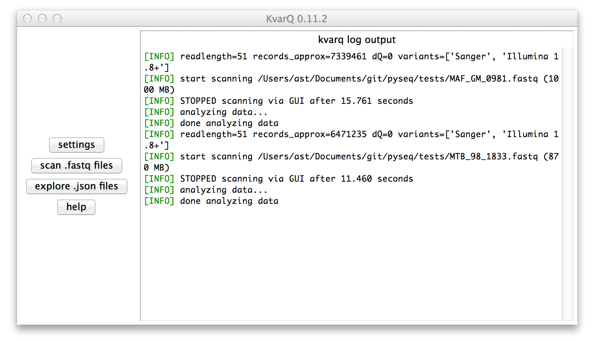
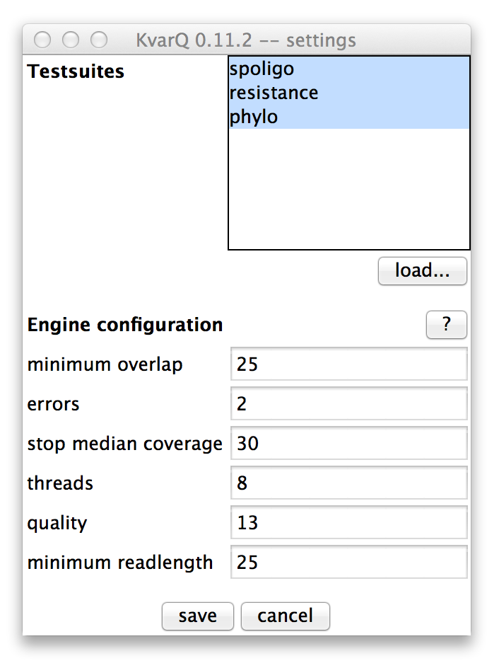
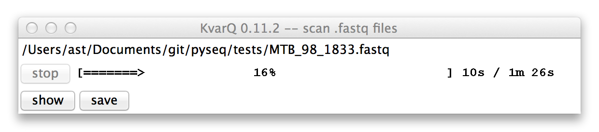
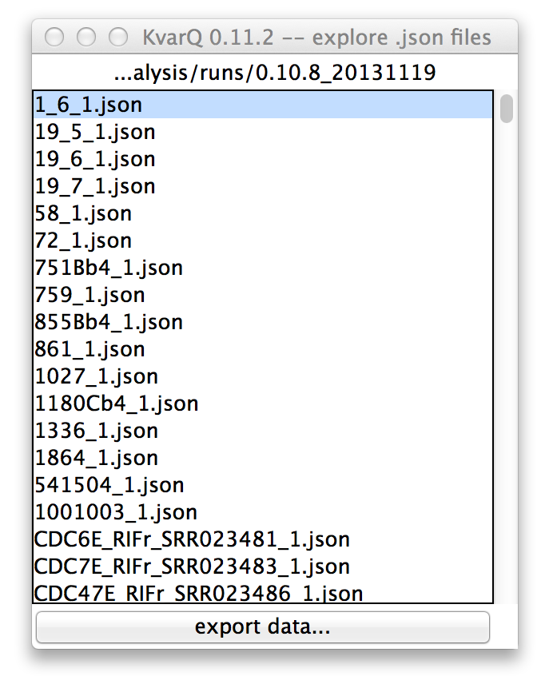
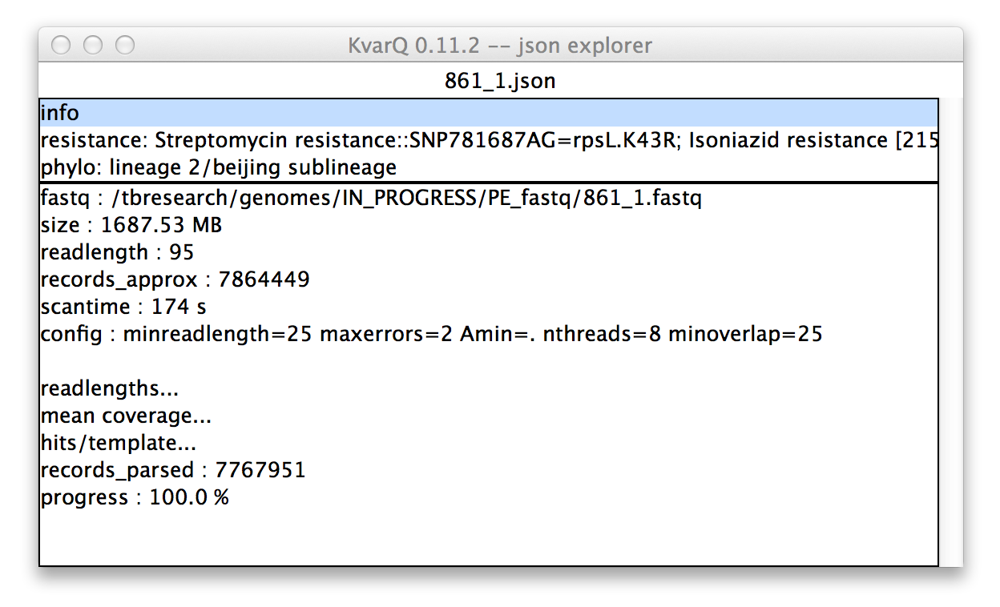
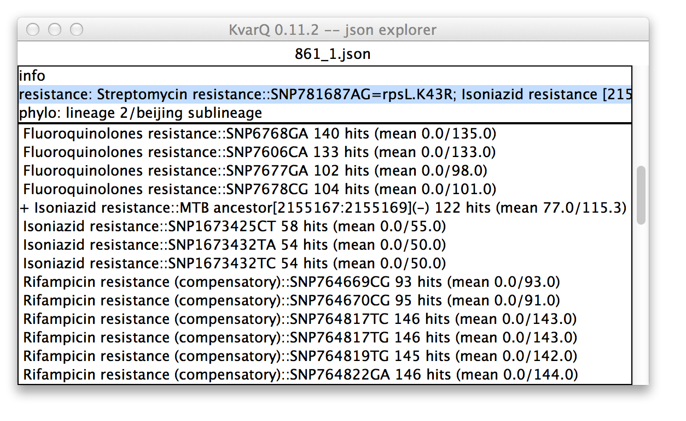
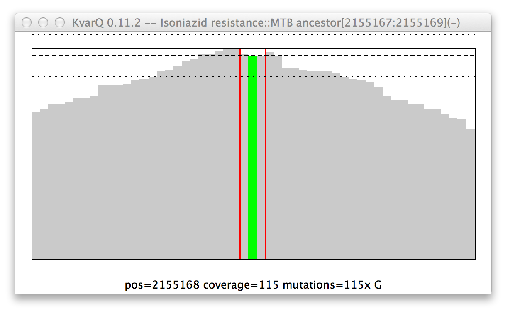
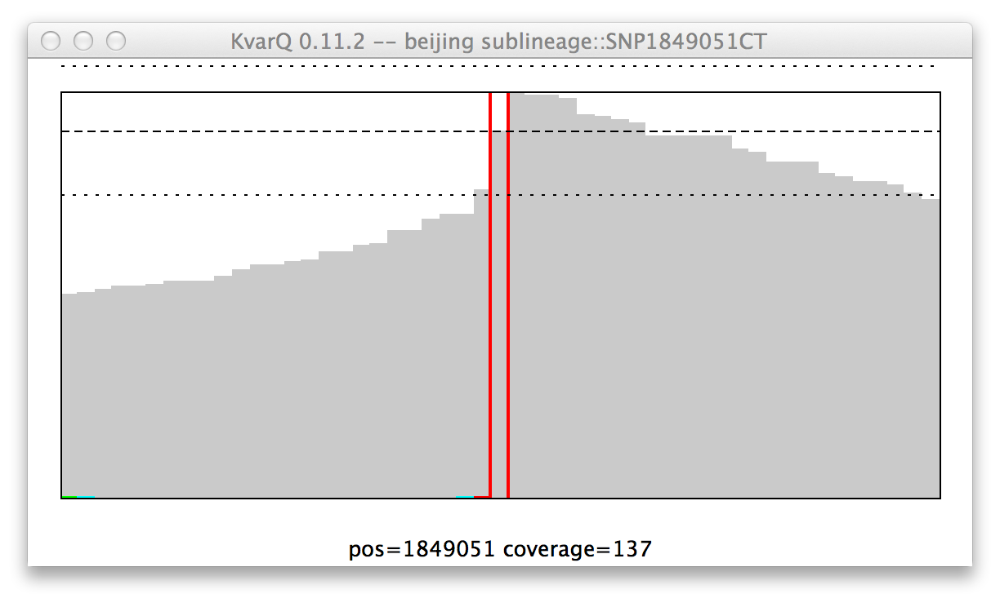
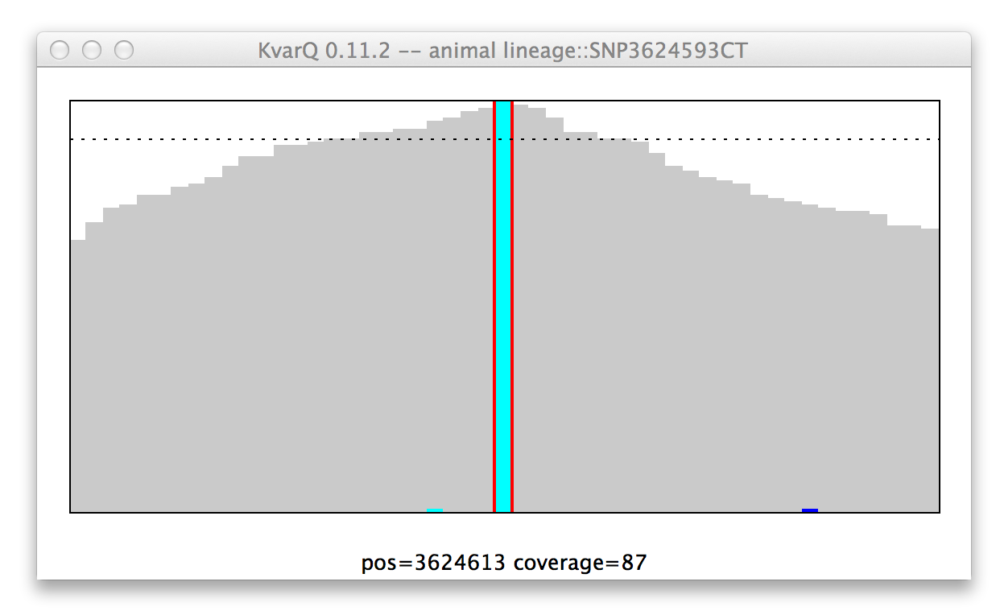

.. _gui:

Using KvarQ Graphical User Interface (GUI)
==========================================

Launching the GUI
-----------------

Depending on :ref:`how KvarQ was installed <installing>`, there
are different ways of launching the GUI

  - Installation from source: simply enter ``kvarq gui`` on the command
    line or alternatively call ``python -m kvarq.cli gui``.  When KvarQ
    is launched this way, you can use some :ref:`command line switches
    <using-cli>` (for example specify the directory containing the
    :ref:`testsuites <testsuites>`).
  - Binary installation windows: go to the directory with the KvarQ
    files and start ``kvarq-gui.exe``
  - Binary installation OS X: open the KvarQ application in the Finder

Below is what you should see after launching the GUI

The right pane in the main window shows the log output that describes the
general activity as well as useful additional information during the scanning
process.  Important messages (warnings, errors) are highlighted in red.

.. _settings:

Configuring KvarQ
-----------------

There are two steps to configure KvarQ:

  1. Specify the :ref:`testsuites <testsuites>` that are known to the program.
     These testsuites can be loaded from different places.  If a testsuite with
     the same name already exists, it is replaced with the one specified last.

     The :ref:`scanner <scanner>` as well as the :ref:`explorer <explorer>`
     need to know these testsuites in order perform the scanning or correctly
     display the results.  After loading testsuites, they appear in the list
     (unless they were replacing another testsuite already listed).  From this
     set of available testsuites, a **selection** can be made that specifies
     which of the testsuites should be used during the scanning process.
     Selecting more testsuites will slow down the scanning process and produce
     larger, more informative files.

  2. The :ref:`engine configuration parameters <configuration-parameters>` can
     also be modified.  Usually, the default values work well, but in some
     cases (such as old low-quality files) it can be advantageous to change
     some of these values.

.. _scanner:

The Scanner
-----------

This simple window allows to scan a single or multiple ``.fastq`` files to
generate ``.json`` files (depending on whether a single or multiple files
are selected in the file selection dialog).

The progress bar (yes, the design is on purpose to remind users to
:ref:`use the command line <cli>`) shows the progress as well as estimated
time left for the **current** file.  The scanning process can be interrupted
by clicking on the ``stop`` button.

Once the scanning process is done (for all files), the results can be saved
to ``.json`` files (one per ``.fastq`` file).   The result of the last scan
can also be viewed directly, without saving it to file.

.. _explorer:

The Explorer
------------

The explorer is a simple Tk program consisting of different windows:

  Directory explorer viewing ``.json`` files in a directory

  Double-clicking any of the list items will open then ``.json`` explorer
  showing details on the selected file.

  It is also possible to **export the analysis summary** of all displayed
  ``.json`` files to a excel sheet by using the button at the bottom of the
  list.

  ``.json`` explorer showing general information about file

  In the **upper pane** of the ``.json`` explorer shows an overview over the
  file. The contents of the **lower pane** depend on the selection in the upper
  pane. Because the **info** section is selected in the upper pane in this
  example, the lower pane shows general information about the scanning process,
  such as the scantime or the ``kvarq.engine`` configuration.

  The items ending with ``...`` open another window when double-clicked
  (similar to the coverages described below).

  ``.json`` explorer showing analysis test details

  In this case, the phylogenetic suite was selected in the **upper pane**.
  Therefore, all tests belonging to this testsuite are displayed in the lower
  pane. Every item in the upper pane (apart from the "info" item) consists of
  the testsuite name (in this case "phylo") and the summarized result (in this
  case lineage 2, sublineage bejing).
  
  Every item in the **lower pane** informs about the following test details:

    - Whether the test was "found positive" : a ``+`` sign in front of the test
      name signifies that this test was positive. For a SNP this means that the
      specified mutant allele was found and for a test covering a larger region
      of the genome this signifies that there was at least one mutation
      detected in the region of interest.

    - Test name that describes the genotype.

    - Double semicolon ``::`` followed by description of what was tested (this
      can be a SNP or a region; regions are specified by their start/stop base
      position and a ``+`` or ``-`` specifying which strand is coding at this
      position).

    - Double-clicking on an item in the lower pane opens a :ref:`coverage
      <coverage>` window.

.. _coverage:

Interpreting Coverages
~~~~~~~~~~~~~~~~~~~~~~

KvarQ displays the results of the scanning process in the form of
**coverages**.  This display shows information about how many reads were mapped
against the sequence of interest and whether there were any mutations detected.
The same display is used for SNPs as well as for longer regions, althoug the
signification of the displayed elements is somewhat different.

.. _region-mutation:

  Mutation in the ``katG`` resistance confering codon.

  General structure of a coverage window:

    - The x axis is the genome **position**. Add the number showed on the x axis to
      the base position in parantheses in the figure title.

    - The y axis is depth of **coverage**, piling all reads up that mapped to the
      given positions.

    - The red vertical lines show start and stop of the **region of
      interest**.  In this case, the region of interest is only three bases
      long, but 25 bases of spacers are added on either side when scanning
      for the region (see :ref:`configuration-parameters`).

    - The horizontal lines are mean and pseudo-variations of coverage over the
      region of interest.

    - The colored graphs show **mutations**. In this example there is clearly a
      mutation that replaced the second base with a guanosine nucleotide. Note
      that not every read showed this mutation, but a handful had the original
      base (if every single read showed this mutation, the colored line would
      go all the way up to the thick black line).

    - Moving the **mouse** over the graph shows quantitative information about
      the hovered genome position at the bottom of the graph.

.. _SNP-hit:

  Coverage of a single nucleotide polyphormism (SNP), **mutant genotype**.

  Because KvarQ is looking for a specific mutant sequence, the SNP is "found"
  if there is no mutation at its position, as is the case in this example
  (i.e. at position 157129 there is really a ``T`` and not a ``C``).

  **Note**: "No color" means mutant for SNP, while it means wild type for
  regions...

.. _SNP-no-hit:

  Coverage of a single nucleotide polyphormism (SNP), **wildtype genotype**.

  **Note**: There's also the (quite unlikely) possibility that there is a new
  (i.e. not-looked-for) SNP. This example shows the ``SNP3304966GA``.  The
  bottom display (``coverage=91 mutations=91x G``) makes it clear that we
  have indeed the wild type.

Keyboard Navigation
~~~~~~~~~~~~~~~~~~~

  - switch between panes using ``Tab``
  - select item using ``up``, ``down``
  - open window by pressing ``enter``
  - close window via ``escape``

