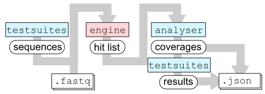
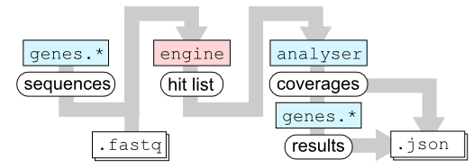
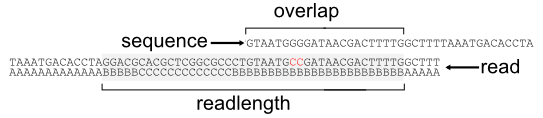

Understanding the Scanning Process
==================================

.. _overview:

Overview
--------

  Simplified overview of scanning process and preparation.

  :ref:`Testsuites <testsuites>` are python source files that define the SNPs
  of interest (or in this case a 3 base pair long region) as well as other
  relevant genetic information (in this case the ``katG`` gene which can confer
  Isoniazid resistance).  This information is used to extract a  "target
  :py:class:`sequence <kvarq.genes.Sequence>`" from a hypothetical ancestral
  MTBC genome:  on both sides, additional bases ("flanks") are concatenated to
  avoid border effects within the sequence of interest.  During the scanning
  process, every read is trimmed depending on its PHRED score (in this case, a
  quality cutoff of ``Q=13`` was defined which corresponds to the ASCII
  character ``/``).  After the scanning, all reads that matched the target
  sequence are assembled to a ":py:class:`coverage <kvarq.analyse.Coverage>`"
  that indicates the overall coverage depth as well as all detected mutations
  (green).  In a further step, additional information is generated from this
  coverage (such as the resulting amino acid sequence) and finally a short
  "result" string is generated that summarizes the result of the scanning
  process.

  This figure illustrates the flow of data inside kvarq.

  Python modules/packages are colored in blue, C extensions in red.  Rectangles
  with rounded corners represent data structures passed along the way.

The :ref:`testsuites <testsuites>` provide a list of **sequences**. The C
extension :py:mod:`kvarq.engine` then scans the ``.fastq`` file and finds all
occurrences of these sequences.  The list of these occurrences (the **hit
list**) is then passed to the module :py:mod:`kvarq.analyser` that maps the
reads onto the original sequences and creates **coverages** (see
:ref:`coverages`).  This coverage is passed back to the different testsuites
that calculates the final **results**.  The coverages are saved along with the
results (and optionally the hit list) into the ``.json`` file.

Testsuites 1/2
~~~~~~~~~~~~~~

Depending on what :ref:`testsuites <testsuites>` are loaded (via the
:ref:`command line <using-cli>` or the :ref:`settings dialog <settings>`),
KvarQ performs different analysis suitable to detect different genomic markers
in different organisms.  The testsuite defines a :py:class:`template
<kvarq.genes.Template>` that is then used to generate a :py:class:`sequence
<kvarq.genes.Sequence>` which is passed along.

Engine
~~~~~~

The (C extension) module :py:mod:`kvarq.engine` is the workhorse of the
scanning process.  It creates multiple threads that scan through the ``.fastq``
file and returns a list of :py:class:`kvarq.engine.Hit` that describe the
position and overlap of reads from the fastq with the different sequences.

This module is actually called from within `kvarq.analyser` and runs in a
separate python thread.  It provides some functions that can be called
asynchronously from the main (CLI/GUI) thread to monitor the scanning process.

Analyser
~~~~~~~~

The module :py:mod:`kvarq.analyser` takes the hit list from the
``kvarq.engine`` and applies the overlaps of the reads with the templates,
creating a :py:class:`kvarq.analyser.Coverage` object for every target
sequence.

Testsuites 2/2
~~~~~~~~~~~~~~

The coverages are then distributed to the different testsuites and every
testsuite does some specific analysis and then reports the final results.  For
example, the MTBC resistance testsuite (``testsuites/MTBC/resistance.py``) first
finds mutations and then determines whether these mutations are synonymous or
non-synonymous and outputs the base mutation as well as the resulting change in
amino acid if the mutation is non-synonymous.

These final results generated by the testsuites are then saved, along with the
coverages, in the ``.json`` file.  The file also contains all relevant scanning
parameters (including testsuites and their versions).

.. _configuration-parameters:

Configuration Parameters
------------------------

  This figure illustrates the different configuration parameters for ``kvarq.engine``

  In this example, ``Amin='B'`` causes that only the gray part of the read
  (number of bases in this part is **readlength**) is considered when the read
  is aligned to the different sequences.  The **overlap** is the number of
  bases that the read and the sequence have in common.  In this example the
  read is aligned despite of the two bases that differ from the sequence --
  this is only the case if ``maxerrors>=2``.

The function :py:func:`kvarq.engine.config` accepts the following parameters

  - ``Amin`` : ASCII character of the Phred score that corresponds to the
    minimal quality score of a base calling to be accepted.  Use method
    :py:meth:`kvarq.fastq.Fastq.Q2A` to translate a Phred score into an ASCII
    value.

  - ``minreadlength`` : After cutting the individual reads using the provided
    ``Amin``, reads shorter than ``minreadlength`` are discarded.

  - ``minoverlap`` : Reads that overlap (at the beginning or the end of the
    sequence) with less bases than the specified values are not reported.

  - ``maxerrors`` : Reads that differ in more than ``maxerrors`` base positions
    are not considered for a match.

  - ``nthreads`` : Number of threads to use in parallel for scanning the
    ``.fastq`` file.

These parameters can be set using :ref:`command line switches <using-cli>` or
in the :ref:`settings dialog <settings>`.

